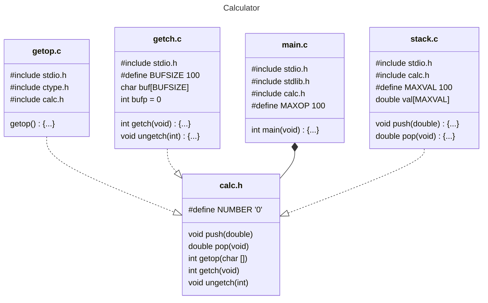

# Chapter 4: Functions and Program Structure

## Examples

### [Pattern Matching](./Examples/Strindex/strindex.c)

A simple pattern matching program using simple string matching a gainst a compiled pattern.

### [String to Floating Point Conversion](./Examples/Atof/atof.c)

Converts a string to a floating point number. Specifically a `double`.

### [Basic Calculator](./Examples/BasicCalculator/calculator.c)

A very simple calculator that adds up floating point numbers one per line.

### Polish Notation Calculator

A simple command line calculator using reverse polish notation.

1. [Single-file Implementation](./Examples/Calculator/SingleFile/calculator.c)
2. [Multi-file Implementation](./Examples/Calculator/MultiFile/)

### [Printing a Number as a String](./Examples/Printd/printd.c)

Demonstrates the use of recursion to print a the decimal representation of a number.

**Note**: We have modified the given example slightly to correct the edgecase for `INT_MIN` in a two's complement signed representation. (See [Ex 3.4](../Chapter3/Chapter3.md#ex-3-4).)

### [Quicksort](./Examples/Qsort/qsort.c)

Demonstrates the use of recursion to perform sort an array by partitioning the array into smaller components.

## Exercises

### [Ex 4-1](./Exercises/Ex4_01/ex4-1.c)

*Write the function `strrindex(s,t)`, which returns the position of the **rightmost** occurrence of $`t`$ in $`s`$, or $`-1`$ if there is none.*

This is straightforward. We introduce a variable `found` that tracks the starting position of the last occurence of $`t`$ in $`s`$, initialising it to a value `NOT_FOUND` (we use $`-1`$.)

Then we scan the string from left to right, updating `found` if we find a match rather than early exiting. `found` thus holds the *rightmost* match (if any).

**Note**: An alternative would be to keep the early-exit, but to scan the string backwards. This requires us to first compute the length of the string. Additionally operating over a string in reverse is typically less *cache-performant*.

However if $`s`$ is reasonably long and repeated in $`t`$ with some regularity, than this approach may be faster as it reduces the number of scans over $`s`$.

**E.g.**
if $`s`$ = "abcdabcdabcdabcdabcdabcd" and $`t`$ = "abcd" we would perform noticeably more scans over $`s`$ operating forward than in reverse. A naive count is:

1. Forward: $`5`$ full scans over $`s`$ (approx $`25`$ comparisons) plus $`18`$ single comparisons against $`s`$ and $`5`$ updates of `found`. (approx $`48`$ comparisons / updates)
2. Backwards: ~$`25`$ comparisons to determine the length of $`s`$ and $`1`$ full scan over $`s`$ (approx $`5`$ comparisons), plus $`3`$ single comparisons. (approx $`33`$ comparisons.)

There are of course other optimisations we could explore.

### [Ex 4-2](./Exercises/Ex4_02/ex4-2.c)

*Extend `atof` to handle scientific notation of the form $`12345e-6`$ where a floating point number may be followed by an `e` or and `E` and an optionally signed exponent.*

This adds an extra step to our parsing. Once we've calculated the `x.yyyy` component we check if there is an `e` (or `E`). We then perform a sign-check. We then parse the exponent (*by convention for scientific notation this number must be an integer.*) Then,

- If the exponent is *positive*, we then perform the loop

```C
for (; exp > 0; exp--) {
  val *= 10;
}
```

- If the exponent is *negative*, we then perform the loop

```C
for (; exp > 0; exp--) {
  val /= 10;
}
```

### Calculator Exercises

The next series of exercises all deal with extending or modifying the implementation of [Calculator](#polish-notation-calculator).

---

#### [Ex 4-3](./Exercises/Ex4_03-7/calculator.c)

*Given the basic framework, it's straightforward to extend the calculator. Add the modulus ($`\%`$) operator and provisions for negative numbers.*

This is straightforward, `atof` already handles the negative sign so we just need to update the `getop` function to check if a `-` is an operator or part of a number. For modulus, we have the fact that the native defined operator relies on `int`. We could use casts to enforce this, but since in [Ex 4-5](#ex-4-5) we are introduced to `math.h` we will use the `fmod` function from that header.

#### [Ex 4-4](./Exercises/Ex4_03-7/calculator.c)

*Add commands to print the top element of the stack without popping, to duplicate it, and to swap the top two elements. Add a command to clear the stack*.

These are all straightforward, we use the symbols `?, ~, @, #` for the `top`, `duplicate`, `swap` and `clear` functions. We can either implement these through the `pop` and `push` operations if we want, but since these are *stack* operations, its reasonable to use the underlying stack representation. (Which allows us to implement them a bit more efficiently.)

#### [Ex 4-5](./Exercises/Ex4_03-7/calculator.c)

*Add access to library functions like `sin`, `exp` and `pow`. See `math.h`.*

This is straightforward, functions are a continuous string started by a lowercase letter and containing lowercase letters and numbers.
We just have to parse this.

We reference the `math.h` header and add the functions supplied there. We also add an error function which reports an error message if a function is called with a value outside its domain.

#### [Ex 4-6](./Exercises/Ex4_03-7/calculator.c)

*Add commands for handling variables. (It's easy to provide twenty-six variables with single-letter names.) Add a variable for the most recently printed value.*

We use uppercase letters (`A...Z`) to make them distinct to parse from functions.

- The symbol `$` is used to access the last printed value.
- A variable in an input stream is replaced by its value.
- `=` is used to track variable assignment using the syntax `3 A =` to mean assign $`3`$ to $`A`$.

This implementation has a few consequences, we need to introduce a variable `var` to track the last seen token. This is because we can't tell until we see the next operator or operand if the variable was used in an *access-its-value* context or a *set-its-value* (`=`) context. For assignments we have to `pop` the `push` of the variables current value from the stack, *then* get the actual assigned value.

#### [Ex 4-7](./Exercises/Ex4_03-7/calculator.c)

*Write a routine `ungets(s)` that will push back an entire string onto the input. Should `ungets(s)` know about `buf` and `bufp`, or should it just use `ungetch`?*

This is simple to implement, we process the string in reverse, pushing each character onto the buffer with `ungetch`.

We don't need to know about the *how* the buffer is managed then, and `ungetch` does all the error handling for us. We could access the buffer directly, but then we would have to introduce our own error-handling and ensure that the implementations of `ungetch` and `ungets` don't conflict.

**Note:** We don't use `ungets` in our calculator implementation. But we will use it later in [Chapter 5](../Chapter5/Chapter5.md#ex-5-10).

#### [Ex 4-8](./Exercises/Ex4_08-9/calculator_v2.c)

*Suppose that there will never be more than one character of pushback. Modify `getch` and `ungetch` accordingly.*

Rather than use a buffer and an index in the buffer, we just need one variable that stores the *ungetched* character and a *sentinel value* to denote the variable being empty. We use the null-terminator `\0`.

#### [Ex 4-9](./Exercises/Ex4_08-9/calculator_v2.c)

*Our `getch` and `ungetch` do not handle a pushed-back `EOF` correctly. Decide what their properties ought to be if an `EOF` is pushed back, then implement your design.*

In the original implementation the buffer is a `char`. This may not handle `EOF` correctly in the case that `EOF` is negative (e.g. $`-1`$) and `char` is unsigned. To handle this replace the underlying type of the buffer with `int`.

#### [Ex 4-10](./Exercises/Ex4_10/calculator_v3.c)

*An alternative organisation uses `get_line` to read an entire input line; this makes `getch` and `ungetch` unnecessary. Revise the calculator to use this approach.*

This is a relatively easy enough thing to change, however we now move from a scenario where we can handle arbitrary length input lines to a fixed size buffer.

#### [Ex 4-11](./Exercises/Ex4_11/getop.c)

*Modify `getop` so that it doesn't need to use `ungetch`. **Hint**: use an internal `static` variable*.

(We will modify the multi-file implementation, rather than our built up version.) We only ever need one character of pushback. So we store the pushed back variable in a static local variable, using `\0` to denote no pushback. Then at our first character read we either read from the local variable or defer to `getch`.

---

### [Ex 4-12](./Exercises/Ex4_12/ex4-12.c)

*Adapt the ideas of printd to write a recursive version of `itoa`; that is, convert an integer into a string by calling a recursive routine*.

The interface of `itoa` doesn't naively work directly for a recursive function because we can't track where we are in the string. However we can use an internal static variable `i` to connect the recursive calls. Once we reach the end of the string, we set `i` to $`0`$, then it increases by $`1`$ as we go up the call-chain.

The order we do things in is important, we recurse to the end of the string, and then perform our writes on the way back up. This automatically handles reversing the string.

### [Ex 4-13](./Exercises/Ex4_13/ex4-13.c)

*Write a recursive version of the function `reverse(s)`, which reverses the string `s` in place.*

Again, like the previous function, the direct interface doesn't match what we need for a recursion. In this case we use `reverse(s)` as a wrapper function around the recursive routine `reverse_r(s, i, j)`.

`reverse_r(s, i, j)` swaps the characters at `s[i]` and `s[j]` then calls itself again with `i` incremented by $`1`$ and `j` decremented by $`1`$. The base case is to stop once $`i >= j`$. `reverse(s)` starts by calling `reverse_r(s, 0, strlen(s) - 1)`.

### [Ex 4-14](./Exercises/Ex4_14/ex4-14.c)

*Define a macro `swap(t, x, y)` that interchanges two arguments of type `t` (Block structure will help.)*.

We use a common `do { ... } while(0)` construct so that the common idiom `if(cond) {swap(...);}` will work as expected. The `while(0)` ensures that the macro contents are only executed once.

## 4.0 Introduction

- Break large computing tasks into smaller ones.
- Good functions seperate layers of abstraction.
- **C** emphasises *procedural programming*, many small functions interacting rather than a few large functions.
- Programs may be split across multiple files.
  - Compiled together or seperately.
- **C** also contains a *preprocessor* for precompilation transformations.

## 4.1 Basics of Functions

### Example [Strindex](#pattern-matching)

- Consider a pattern matching algorithm that returns the lines containing a given pattern.
- The code outline looks like

```C
while (there is a line) {
    if (the line has the pattern) {
        print it;
    }
}
```

- This naturally falls into three functions.

1. The first part is `get_line` we've seen before.
2. For the second we write a function `strindex(s, t)` that returns the first index in `s` where the string `t` begins, else $`-1`$.
    1. Since array indices are non-negative.
    2. Means in the future can rewrite `strindex(s, t)` to use more sophisticated pattern matching without touching the rest of the program.

**Example continued:**

```C
#include <stdio.h>
#define MAXLINE 1000 /* maximum input line length */

int getline(char line[], int index);
int strindex(char source[], char searchfor[]);

char pattern[] = "ould"; /*pattern to match */
main()
{
    char line[MAXLINE];
    int found = 0;

    while (getline(line, MAXLINE) > 0) {
        if (strindex(line, pattern) >= 0) {
            printf("%s", line);
            found++;
        }
    }
    return found;
}

/* getline: get line into s, return length */
int getline(char s[], int lim)
{
    int c, i;
    i = 0;
    while (--lim > 0 && (c = getchar()) != EOF && c != '\n')
    {
        s[i++] = c;
    }
    if (c == '\n') s[i++] = c;
    s[i] = '\0';
    return i;
}

/*strindex: return index of t in s, -1 if none */
int strindex(char s[], char t[])
{
    int i,j,k;
    for (i = 0; s[i] != '\0'; i++) {
        for (j=i, k=0; t[k] != '\0' && s[j]==t[k]; j++, k++);
        if (k > 0 && t[k] == '\0') return i;
    }
    return -1;
}
```

- Observe the first for loop acts as the starting index, we then scan forward to see if we have the full pattern.

### Function Declarations

- Function declarations have the form

```C
return-type function-name(argument declarations)
{
    declarations and statements
}
```

- Parts may be omitted, the minimal function is

```C
dummy() {}
```

- This returns nothing, takes no arguments and does nothing.
  - Omitted return type is assumed `int`.
  - **Warning**: *not sure if still true for modern $c$ standards*
  - Just do the full proper declaration.
  - **Note**: Until **C23** a declaration of the form `dummy()` is a function that takes an unknown number of arguments, while `dummy(void)`  means a function that takes no arguments.

### Programs

- A *program* is a series of definitions of variables and functions.
  - Functions communicate by arguments and return values.
    - (plus external variables)
  - Functions may occur in any order in the source file.
    - Source program may be across multiple files.
    - Individual functions must reside in one file.

### Return Expression

Syntax is `return expression;`

- Any expression may follow `return`.
- Expression converted to the return-type (if needed).
- Calling function may ignore return value.
- Control returns to caller after calling return.
  - Even if `return` has no expression.
  - Control returns to caller if program 'falls off' the last right bracket.
- Not *illegal* but **not good** if a function returns a value from one point, and does not at another.
  - Failure to return a value results in the "return value" being garbage.

- `main` like other functions  can return a value, this can be used by the environment executing the program.
  - Convention is to return `0` for successful execution.
  - Non-zero values typically represent error codes.

### Relevant Exercises

See [Ex 4.1](#ex-4-1).

## 4.2 Functions returning Non-Integers

- Many functions e.g. numerical ($sin, cos$ *etc.*) return non-integer types (if anything.)

### Example [Atof](./Examples/Atof/atof.c)

- Converts a string to a floating point value with an optional decimal point and sign.

```C
#include <ctype.h>

/* atof: convert string s to double */
double atof(char s[])
{
    double val, power;
    int i, sign;
    for (i = 0; isspace(s[i]); i++) /* skip whitespace */
    
    sign = (s[i] == '-') ? -1 : 1;
    if (s[i] == '+' || s[i] == '-')
        i++;
    for (val = 0.0; isdigit(s[i]); i++)
        val = 10.0 * val + (s[i] - [0]);
    if (s[i] == '.')
        i++;
    for (power = 1.0; isdigit(s[i]); i++)
    {
        val = 10.0 * val + (s[i] - '0');
        power *= 10;
    }
    return sign*val / power
}
```

- Calling routine must know `atof` returns a non-int value.
  - Can be done by declaring `atof` explicitly in calling routine.

### Example [Floating Point Summation](#basic-calculator)

```C
#include<stdio.h>

#define MAXLINE 1000

/* rudimentary calculator */
int main()
{
    double sum, atof(char []);
    char line[MAXLINE];
    int getline(char line[], int max);

    sum = 0;
    while (getline(line, MAXLINE) > 0)
        printf("\t%g\n", sum += atof(line));
    return 0;
}
```

- The line `double atof(char []);` says that `atof` is a function that takes one `char[]` argument and returns a `double`.
  - `atof` must be declared and defined consistently.
    - These mismatches can occur most often in multifile compilation.
  - Without a *prototype*, a function is defined *implicitly* by its first declaration.
    - If not declared, it is assumed to return an `int` and no argument assumptions are made.
    - Additionally declarations like `double atof()` with empty args also make no assumptions on the args.
      - **DO NOT USE THIS BEHAVIOUR, IT IS FOR BACKWARDS COMPATABILITY**
      - Declare args for those that use them, else use `void`.
      - **Note**: From **C23** this is removed, empty brackets now imply no arguments.

We can write an `atoi` using `atof`.

```C
/* atoi: convert string s to int using atof */
int atoi(char s[])
{
    double atof(char s[]);

    return (int) atof(s);
}
```

- We have to cast `atof`'s result to get an  `int`.
  - The return converts automatically.
    - This operation may discard info so might have compiler warnings.
    - Cast makes this *explicit* and warning should be supressed.

### Relevant Exercises

See [Ex 4.2](#ex-4-2).

## 4.3 External Variables

- C program made of sets of external objects (variables or functions) and *internal* objects (args and variables declared in a function).
- External variables are declared outside of any function.
  - Available to many functions.
  - Functions are always external.
  - Can't define a function in a function.
- For *external* functions and variables, all references to them by the same name are references to the same thing.
  - This includes when compiled seperately.
  - Referred to as *external linkage*.
- External variables let functions communicate outside of args and return values.
  - Avoids long argument lists, but not great.
  - Good when functions share the same data, but neither calls the other.
    - E.g. Immutable global state.

### Example: [Calculator](#polish-notation-calculator)

- Provide the operators `+, -, *, /` using (reverse) polish notation.
  - e.g. $(1 - 2) * (4 + 5) -> $ `1 2 - 4 5 + *`

- **Implementation:** Operand pushed onto stack, when operator arrives we pop the appropriate number of args from the stack, then apply the result and push it back onto the stack

*Pseudocode:*

```C
while (next token not EOF) {
    if (number) {
        push it;
    } else if (operator) {
        pop operands;
        perform operation;
        push result;
    } else if (newline) {
        pop + print stack top;
    } else {
        error;
    }
}
```

- Main doesn't need to know about the stack.
  - So store stack + info in external variables.

#### Implementation

```C
#include <stdio.h>
#include <stdlib.h>

#define MAXOP 100 /* max size of operand or operator */
#define NUMBER 0; /* signal that number was found */

int getop(char []);
void push(double);
double pop(void);

/* reverse Polish calculator */
int main()
{
    int type;
    double op2;
    char s[MAXOP];

    while ((type = getop(s)) != EOF)
    {
        switch(type)
        {
        case NUMBER:
            push(atof(s));
            break;
        case '+':
            push(pop() + pop());
            break;
        case '*':
            push(pop() + pop());
            break;
        case '-':
            op2 = pop();
            push(pop() - op2);
            break;
        case '/':
            op2 = pop();
            if (op2 != 0.0)
                push(pop() / op2);
            else
                printf("error: zero divisor\n")
            break;
        case '\n':
            printf("\t%.8g\n", pop());
            break;
        default:
            printf("error: unknown command %s\n", s);
            break;
        }
    }
    return 0;
}
```

Because $`+`$ and $`*`$ are commutative the order of popping is irrelevant, but this is not the case for $`-`$ and $`/`$.

- `push(pop() - pop())` does not guarantee which `pop` executes first, hence we need to use a temporary variable.

The `push` and `pop` can be implemented as follows

```C
#define MAXDEPTH 100 /* max stack depth */

int sp = 0; /* next free stack position */
double val[MAXDEPTH]; /* value stack */

/* push f onto value stack */
void push(double f)
{
    if (sp < MAXDEPTH) val[sp++] = f;
    else {
        printf("error: stack full, can't push %g\n", f);
    }
}
/* pop and return top value from the stack */
double pop(void)
{
    if (sp > 0) return val[--sp];
    else
    {
        printf("error: stack empty\n");
        return 0.0;
    }
}
```

- Variable is external if it is declared outside of any function.
  - e.g. `stack` and `stack index` are shared by push and pop so are declared external.
  - `main` itself does not refer to either variable.

- *last function to implement is `getop`*.
  - Skip whitespace.
  - If next character is not a *digit* or *hexadecimal point* return it.
    - Else collect digits (with optional decimal).
    - Return signal `NUMBER` that we collected a number.

```C
#include <ctype.h>

int getch(void);
void ungetch(int);

/* getop: get next character or numeric operand */
int getop(char s[])
{
    int i, c;

    while((s[0] = c = getch()) == ' ' || c == '\t');

    s[1] = '\0';
    if (!isdigit(c) && c != '.') return c; 
    /*not a number */
    i = 0;
    if (isdigit(c)) /* collect integer part */
    {
        while(isdigit(s[++i] = c = getch()))
    }
    if (c == '.') /* collect fraction part */
    {
        while(isdigit(s[++i] = c = getch()))
    }
    s[i] = '\0';
    if (c != EOF) ungetch(c);
    return NUMBER;
}
```

- What are `getch()` and `ungetch()`?
  - Often need to read input until we read too much to know we've read enough.
  - e.g. building number -> have to see **not** a digit to know we've finished.
  - Need to *undo* the last read.
- Make pair of cooperating functions `getch()` and `ungetch()`.
  - Implementation simple: `getch()` and `ungetch()` share a buffer
    - Here its a `char` array
    - `getch()` reads from the buffer, then from IO
    - `ungetch()` queues the buffer
    - This works like the stack, so here use external variable implementation

```C
#define BUFSIZE 100

char buf[BUZSIZE]; /*buffer for ungetch()*/
int bufp = 0;

int getch(void)
{
    return (bufp > 0) ? buf[--bufp] : getchar();
}

void ungetch(int c)
{
    if (bufp >= BUFSIZE)
    {
        printf("ungetch: too many characters\n");
    }
    else
    {
        buf[bufp++] = c;
    }
}
```

- **Note**: the standard library provides an `ungetch()` function that provides one character of pushback.

### Relevant Exercises

See [Ex 4.3](#ex-4-3), [Ex 4.4](#ex-4-4), [Ex 4.5](#ex-4-5), [Ex 4.6](#ex-4-6), [Ex 4.7](#ex-4-7), [Ex 4.8](#ex-4-8), [Ex 4.9](#ex-4-9) and [Ex 4.10](#ex-4-10).

## 4.4 Scope Rules

- Functions and external variables comprising a C program need not be compiled at the same time.
  - Source code can be split across files.
  - Can load precompiled routines.

*Questions*

1. How are declarations written s.t. variables are properly declared during compilation?
2. How are declarations arranged s.t. all the pieces are properly connected?
3. How are declarations organised so there is only one copy?
4. How are external variables initialised?

The *scope* of a name is the part of a program within which a name can be used.

For *Automatic variables* declared at the start of a function

- The *scope* is then  the function the variable is declared within.
- Local variables of the same name in different functions are unrelated.
  - Same for function parameters.
  - They are effectively local variables.

For *External variables and functions*, then

- From the point it is declared to the end of the file being compiled.
  - e.g. if `main`, `sp`, `val`, `push` and `pop` are defined in one file, in the order shown above, (see below)
  - Variables `sp` and `val` are visible in `push` and `pop` but not in `main`.
    - (**Note**: `push` and `pop` are also not available in `main`.)
- To reference an external variable before it is defined (or if defined in a different file) use the `extern` keyword.

```C
int main(void) {...}
int sp = 0;
double val[MAXVAL];
void push(double f) {...}
double pop(void) {...}
```

**Note** a *declaration* is different to a *definition*.

- *Declaration* announces property of variables (namely *type*).
- *Definition* also sets aside storage.
- e.g. consider the lines below, outside a function

    ```C
        int sp;
        double val[MAXVAL];
    ```

- This *defines* the external variables `sp` and `val`, they are also *declarations* for the rest of the current **source file**.

Conversely, consider

```C
extern int sp;
extern double val[];
```

- *Declares* for the rest of the source file, that `sp` is an `int` (and `val` is a `double` array), the variables are not created, and storage is not reserved.
- There must be **only one** *definition* of an external variable among all of the component files of a source program.
  - Other files use `extern` to access the *definition*.
  - Array sizes must be specified in the *definition*.
    - Optional in an `extern` *declaration*.
- Initialisation  of an external variable only goes w/ definition.

**Example**:

- Can define `push` and `pop` in one file, and connect to the variables `sp` and `val` in another.

```C
in file1:
    extern int sp;
    extern double val[];

    void push(double f) { ... }
    double pop(void) { ... }

in file2:
    int sp = 0;
    double val[MAXVAL];
```

## 4.5 Header Files

### Example [Multifile Calculator Implementation](#polish-notation-calculator)

The calculator program could be split into multiple files, one such architecture is in the diagram below.



- `main` occupies one file.
- `push`, `pop` and their variables in another. (Stack functionality.)
- `getop` into a third.
- `getch` and `ungetch` into a fourth. (I/O functionality.)
- Each file handles one *aspect* of the program.
- Need to share definitions and declarations across files.
  - Ideally centralise this.
  - Common material -> *header file* (denoted .h)
    - Here called `calc.h`.
    - This can be utilised via `#include`.
- **Note** for larger programs, seperating  out into multiple header files may be better.

## 4.6 Static Variables

Variables `sp` and `val` in `stack.c` and `buf` and `bufp` in `getch.c` are for private use of their functions. They are not supposed to be used outside their own source file.

- `static` declaration (applied to external variable or function).
  - Limits scope to rest of source file being compiled.
  - External `static` allows to hide names of private external variables.

**Example**

```C
static char buf[BUFSIZE] /* buffer for ungetch() */
static int bufp = 0; /*next free position in buffer */

int getch(void) { ... }
void ungetch(int c) { ... }
```

- No routines aside from `getch` and `ungetch` may use `buf` and `bufp`.

`static` can also be applied to functions.

- Makes function invisible outside of source file, as opposed to global by default behaviour of function.
- Can apply to local / internal variables.
  - Still local to a function like automatics.
  - Remain in existence pre and post function call.
  - Provide private, permanent storage within a fn call.

### Relevant Exercises

Se [Ex 4.11](#ex-4-11).

## 4.7 Register Variables

- `register` declaration indicates a variable is heavily used.
  - Suggests that it be stored in machine registers.
  - Compiler may ignore the advice.
- May only be applied to automatic variables or function parameters.

**Example**

```C
register int x;
register char c;
```

or

```C
void f (register unsigned m, register long n) {
  register int i;
}
```

It is not possible to take the *address* of a register variable. ( A concept we shall see later.)

- **Note** This is the only real modern usecase of `register` as compilers are typically smarter than you!
  - Results in warnings/errors being generated if you try to take the address.

## 4.8 Block Structure

- C is not block structured. (like Pascal)
  - **cannot** define functions inside functions.
  - **can** define variables within a block.

- Declarations of variables may follow the left brace introducing any compound statement.
- Variables introduced this way hide identically named variables in outer blocks.
  - Use `-Wshadow` during compilation to flag this.
- Lifetime extends until the corresponding right brace.

**Example**

```C
if (n > 0)
{
    int i; /* declares new var i */
    for (i = 0; i < n; i++)
}
```

- Scope of `i` is the `true` branch of the `if`.
  - `i` unrelated to any `i` variable outside the block.
  - Automatic variable initialised each time the block is entered.
- Automatic variables and function parameters hide external variables and functions of the same name.

**Example**

```C
int x;
int y;

f(double x)
{
    double y;
}
```

- Within `f`, `x` refers to the param, `y` refers to the automatic variable.
- Outside they refer to the external vars `x,y`.
- Avoid shadowing outer scope names, they lead to confusion.
  - See `-Wshadow` mentioned earlier.

## 4.9 Initialisation

- Absent explicit initialisation:
  - *static* and *external* are initialised to zero.
  - *automatic* and *register* variables are undefined.
- *scalar* variables initialised with syntax
  - `variable = value`.
- *Automatic* and *register* variables may be initialised by any well-defined expression.
- *External* and *static* must be defined by compile-time constants.

**Examples**

```C
int x = 1
char squota = '\'';
long day = 1000L * 60L * 24L /* millseconds per day */
```

**Example: rewritten BinSearch**

```C
int binsearch(int x, int v[], int n)
{
    int low = 0;
    int high = n - 1;
    int mid;
}
```

The initialisation of `low` uses a constant, `high` uses a previous variable, `mid` is not initialised.

### Array initialisation

- Arrays can be initialised with a  comma-seperated list enclosed in braces, e.g.

```C
int days[] = {31, 28, 31, 30, 31, 30, 31, 31, 30, 31, 30, 31}
```

- For arrays of undefined size, the size is computed from the length of the initialiser list.
- If array size defined and $\text{len}(\text{list}) < \text{len}(\text{array})$, remaining indices are set to zero.
  - if $\text{len}(\text{list}) < \text{len}(\text{array})$ an error is generated.
  - Repetition cannot be specified.
  - cannot declare an element at index $i$ without declaring the value of the preceding indices.
- `char` arrays may be initialised with string notation `"string"`.

**Note**: C99 significantly changes the ways in which an array can be declared. It is too extensive to detail all the methods here, but refer to the [cppreference page](https://en.cppreference.com/w/c/language/array_initialization).

**Example**

```C
char pattern = "ould"; /* is equivalent to: */
char pattern[] = {'o', 'u', 'l', 'd', '\0'};
/* note the NULL termination */
```

## 4.10 Recursion

- C functions may be used recursively.
  - i.e. call themselves (directly or not.)

### Example: [printd](#printing-a-number-as-a-string)

- Digits generated wrong order, (low before high).
  - Can be solved recursively.

```C
#include <stdio.h>

/* printd : print n in decimal */
void printd(int n)
{
    if (n < 0) {
        putchar('-');
        n = -n;
    }
    if (n / 10) printd(n / 10);
    putchar(n % 10 + '0');
}
```

- On a recursive call:
  - fresh set of automatic vars generated.
  - These are independent to the higher calls.
- e.g. in `printd(123)` the call structure is
  - `printd(123)`
  - `printd(12)`
  - `printd(1)`
  - and prints $123$.

**Example: Quicksort**

- Invented by Tony Hoare (1962).
- Given array, choose an element $x$,
  - Partition into two subsets,

$$A : a \in A \iff a < x, \\
B : b \in B \iff b \geq x$$
- Repeat recursively on $A$ and $B$.
- Stop condition is set size $< 2$ since automatically sorted.

```C
/*qsort:  sort v[left]...v[right] in ascending order*/
void qsort(int v[], int left, int right)
{
    int i, last;

    if (left >= right) return; /* < 2 elems left*/
    swap(v, left, (left + right) / 2);
    /* partition element moved to left */
    last = left;
    for (i = left + 1; i <= right; i++) {
        /* partition */
        if (v[i] < v[left]) swap(v, ++last, i);
    }
    swap(v, left, last); /*restore partition elem */
}

void swap(int v[], int i, int j)
{
    int temp;

    temp = v[i];
    v[i] = v[j];
    v[j] = temp;
}
```
- Standard library contains *qsort* which can sort any comparable object.
- Recursion typically is cleaner to read, but,
    - Requires allocation of stack memory.
    - Is not faster.

### Relevant Exercises

See [Ex 4.12](#ex-4-12) and [Ex 4.13](#ex-4-13).

## 4.11 The C Preprocessor
- A conceptual first step in compilation.
- Most common uses,
    - `#include` to include file contents.
    - `#define` for textual substitution of a token.
- Alternative use cases include,
    - Conditional compilation.
    - Functionlike macros / macros with arguments.

### File Inclusion
- Source line of the form:
    - `#define "filename"`
- or
    - `#define <filename>`
- Are replaced by contents of the file *filename*.
    - Quoted searches from source file's location, else and if:
    - <> search method is *implementation-defined*.
- Common to use to include:
    - Common `#defines`.
    - Common `extern` variables.
    - Function prototypes.

**Note**: Strictly speaking, headers need not be files, since access is implementation defined for < > includes.

- `#include` is the prefered way to tie declarations together for a large program.
    - Ensures all files have same definitions and variable declarations.

### Macro Substitution

- Macro definition has the form
    - `#define name replacement-text`.
    - Token `name` is replaced by `replacement-text`.
    - *replacement-text* may be arbitrary.
    - Can continue a definition  across multiple lines using `\` at a line end.
    - Macro name scope is from the `#define` to the end of the compiled source file.
    - Definition may use previous definitions.
- substitution only for tokens, do not occur within strings.
    - e.g. if we `#define YES`,
        - `printf("YES");` and `YESMAN` are unchanged.
        - `YES MAN` would be substituted though.

- Any name may be defined.

**Example: Forever**

```C
# define forever for (;;) /* infinite loop*/
```

which creates an infinite loop.

- Macros can be defined with arguments.

**Example: max**

```C
 #define max(A, B) ((A) > (B) ? (A) : (B))
```

- Macros expand into inline code.
  - Each occurence of a *formal parameter* (A or B here) is replaced by the corresponding argument.

**Example: max use case**

```C
x = max(p+q, r+s)
/* this expands out to: */
x = ((p+q) > (r+s) ? (p+q) : (r+s))
```

- If arguments are treated consistently this is type generic.
- **Note** macros have some pitfalls!
  - In the above each expr is evaluated twice (e.g. $`p+q`$).
  - **VERY BAD IF THERE ARE SIDE EFFECTS**
  - e.g. `max(i++, j++) /* WRONG */ `
    - The larger value is incremented twice.
    - Need parentheses to ensure order of operations preserved.
    - e.g. `#define square(x) x * x`.
      - Then `square(z +1)` expands to `z + 1 * z + 1`.
    - From order of operations this becomes:
      - `z + z + 1` = `2z + 1`.
- Functionlike macros are thus useful but should be used sparingly.
    - e.g. `getchar()` and `putchar()` typically macros.
        - Avoids runtime cost of a function call per `char`.
        - `<ctype.h>` also uses macros for its functions.
- Can undefine names using `#undef`.
  - Helps ensure a routine is a function.

```C
# undef getchar

int getchar(void) {...}
```

- Formal parameters not replaced in quoted strings.
  - If parameter name preceded by `#` in replacement text expand out to quoted string with parameter substituted.

**Example: Debugging Macro**

```C
# define dprint(expr) printf(#expr " = %g\n", expr)
```

- The above example uses string concatenation, and behaves as

```C
dprint(x/y) /* expands to */
printf("x/y" " = %g\n", x/y) /* strings concatenate to */
printf("x/y = %g\n", x/y)
```

- Within the macro argument `'` and `"` are converted to `\'` and `\"` respectively.
  - Input is thus a valid string literal.

- Preprocessor provides `##` for argument concatenation during macro expansion.
  - Parameter in replacement text adjacent to `##`:
    - Parameter replaced by actual argument.
    - `##` and whitespace removed.
    - Result rescanned.

**Example: Paste**

```C
# define paste(front, back) front ## back

/* example usecase */
paste(name, 1) -> name1
```

- Nested `##` rules are complicated.

### Conditional Inclusion

- Preprocess can be controlled with conditional statements.
  - Allows selective code inclusion.
- `#if` evaluates a constant integer expression.
  - No `sizeof`, casts or `enum` constants.
  - If expression non-zero,
    - Execute subsequent lines until `#endif, #elif or #else`.
    - Expression `defined(name)` in an `#if` evaluates as
      - $`1`$ if *name* is defined.
      - $`0`$ otherwise.

**Example: header file inclusion**

- The following wrapper around the contents of `hdr.h` ensures `hdr.h` is included only once

```C
# if !defined(HDR)
# define HDR

/* contents of hdr.h go here */

# endif
```

- First inclusion defines the name `HDR`.
- Future inclusions check for the existence of `HDR` skip the file contents.
- If used consistently,
    - Headers may include other headers.
    - User need not worry about interdependencies.

**Example: selecting the correct header**

- This example tests the name `SYSTEM` and selects the appropriate `HDR` file to include,

```C
# if SYSTEM == SYSV
    #define HDR "sysv.h"
# elif SYSTEM == BSD
    #define HDR "bsd.h"
# elif SYSTEM == MSDOS
    #define HDR "msdos.h"
# else
    #define HDR "default.h"
# endif
# include HDR
```

- We can use `#ifndef` and `#ifdef` as specialised forms to test for if a name is defined. The first example can be rewritten as

```C
# ifndef HDR
# define HDR

/* contents of hdr.h */

# endif
```

### Relevant Exercises

See [Ex 4.14](#ex-4-14).
