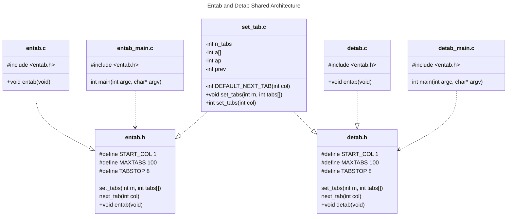
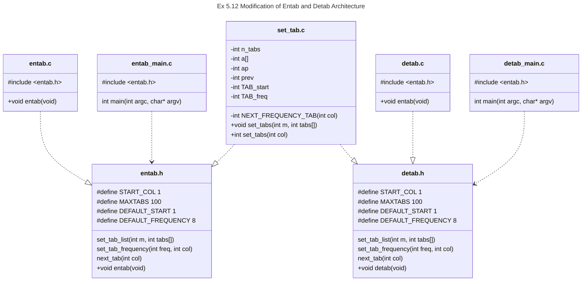

# Chapter 5: Pointers and Arrays

## Examples

### [Swapping two integers](./Examples/Swap/swap.c)

Swaps two integer values.

### [Reading an integer from Input](./Examples/GetInt/getint.c)

Reads a series of integers from standard input and stores them in an array.

### [Line Sorting](./Examples/SortLines/sort_lines.c)

Sorts a set of lines into lexigraphical order by using an array of pointers.

### String Length

Determine the length of a string regardless of if it is a literal, array or pointer through the use of array to pointer decay.

#### [strlen v1](./Examples/Strlen/v1/strlen.c)

#### [strlen v2](./Examples/Strlen/v2/strlen.c)

### [Simple Allocator](./Examples/Alloc/alloc.c)

Demonstrates pointer arithmetic through a simple stack allocator.

### [String Copy](./Examples/Strcpy/strcpy.c)

Demonstrates three different implementations of copying a string.

### [String Comparison](./Examples/Strcmp/strcmp.c)

Demonstrates the array vs pointer implementation of a function for the lexigraphical ordering of strings.

### [Convert Day-Month to Day of the Year](./Examples/CalenderConversion/calender_conversion.c)

Demonstrates the use of a multidimensional array to handle calender conversion between year, month, day and day-of-year, year representations.

### [Month String Representation](./Examples/MonthName/month_name.c)

Demonstrates the use of a static array of character pointers to allow for the indexed lookup of a string representation of a given month.

### Echoing Command Line Arguments

Demonstrates how to access command line arguments through a simple program that outputs the command line arguments on stdout.

#### [Echo - Array Notation](./Examples/Echo/ArrayVersion/echo.c)

#### [Echo - Pointer Notation](./Examples/Echo/PointerVersion/echo.c)

### Improved Pattern Matching

Improves the [pattern matching](../Chapter4/Chapter4.md#pattern-matching) from Chapter 4 by taking the pattern
as a command line argument.

#### [Pattern Matching v1](./Examples/PatternMatching/v1/find.c)

#### [Pattern Matching v2](./Examples/PatternMatching/v2/find.c)

Improves on the first version by introducing UNIX style optional arguments to invert which is printed (matching or non-matching) and number the lines.

## Exercises

### [Ex 5-1](./Exercises/Ex5_01/getint.c)

*As written, `getint` treats a $`+`$ or $`-`$ not followed by a digit as a valid representation of zero. Fix it to push such a character back on the input.*

This is straightforward. If we read a `+` or `-` and no subsequent digit, `ungetch` the character and `return 0` to indicate a failed read.

**Note**: This means that a `+` or `-` will sit in the input buffer and the caller will have to remove it through other means. Our driver code does not handle this.

### [Ex 5-2](./Exercises/Ex5_02/main.c)

*Write `getfloat`, the floating-point analog of `getint`. What type does `getfloat` return as its function value?*

The implementation is straightforward from our implementation of [atof](../Chapter4/Chapter4.md#ex-4-2). But recall here the floating-point is passed out via the pointer and the return code indicates the read state, this is still an `int`.

### [Ex 5-3](./Exercises/Ex5_03/ex5-3.c)

*Write a pointer version of the function `strcat` that we showed in Chapter 2: `strcat(s, t)` copies the string `t` to the end of `s`.*

Simple, iterate the pointer `s` until we reach the end of `s`, then iterate `s` and `t` forward together as pointers copying `t` into `s` until the end of `t` is reached.

### [Ex 5-4](./Exercises/Ex5_04/ex5-4.c)

*Write the function `strend(s, t)`, which returns $`1`$ if the string $`t`$ occurs at the end of the string `s`, and zero otherwise.*

Keeping pointers to the start of $`s`$ and $`t`$ use new pointers to walk both to the end of the respective strings. Then walk back comparing the last character of $`s`$ with the last character of $`t`$ and so on. If we get a mismatch report that $`t`$ does not end $`s`$ else if we get to the end of $`t`$ without issue, then it does.

### [Ex 5-5](./Exercises/Ex5_05/)

*Write versions of the library functions `strncpy`, `strncat` and `strncmp`, which operate on at most the firs $`n`$ characters of their argument strings. For example, `strncpy(s, t, n)` copies at most $`n`$ characters of `t` to `s`.*

These all follow the general principles of the last two exercises, typically replacing `s[i]` type syntax with `*s` and interating on the pointer. In some cases we may need to store a pointer to the start of the string.

### [Ex 5-6](./Exercises/Ex5_06/)

*Rewrite appropriate programs from earlier chapters and exercises with pointers instead of array indexing. Good possibilities include [get_line](../Chapter1/Chapter1.md#longest-line), [atoi](../Chapter2/Chapter2.md#string-to-integer), [itoa](../Chapter3/Chapter3.md#integer-to-string-conversion) and their variants, [reverse](../Chapter3/Chapter3.md#string-reversal), and [strindex](../Chapter4/Chapter4.md#pattern-matching) and [getop](../Chapter4/Chapter4.md#polish-notation-calculator).*

Again the principles of the previous exercises largely apply. We've done all of the above, including the floating point version of `atoi` and `strrindex`. However we won't bother with `getop` since it's quite coupled to the [Calculator program](../Chapter4/Chapter4.md#polish-notation-calculator).

### [Ex 5-7](./Exercises/Ex5_07/ex5-7.c)

*Rewrite `readlines` to store lines in an array supplied by `main` rather than calling `alloc` to maintain the storage. How much faster is the program?*.

We change the signature of `read_line` to take two additional arguments, the first a `buffer` to store the strings in, and the second a *size* parameter for the buffer. We then copy strings directly into the buffer rather than deferring to `alloc`.

**Note**: The `alloc` we implemented is using an array to store the functions under the hood. We generate the following times via gprof and running the program on the same test file containing almost 500,000 lines of randomly generated paragraphed text.

| Method           | Time (s) |
|------------------|----------|
| alloc function   | 1.07     |
| buffer parameter | 1.04     |

Which shows that the buffer method is about 20 milliseconds faster. Obviously this is just one test and so not super comprehensive but there we go.

We conducted a similar analysis on a smaller file of about 200,000 lines. Using grof, we find, *considering only the time in qsort*.

| Method           | Time (ms) |
|------------------|----------|
| alloc function   |  70      |
| buffer parameter | 50       |

Which again shows the parameter approach being slightly faster. However, if we use callgrind to analyse the results we see,

| Method        | Instructions  |
|---------------|---------------|
| Alloc Method  | 7,541,571,916 |
| Buffer Method | 7,542,748,607 |

So there is a negligable difference.

### [Ex 5-8](./Exercises/Ex5_08/ex5-8.c)

*There is no error checking in `day_of_year` or `month_day`. Remedy this defect.*

This is straightforward bounds checking. Since in our *enumeration* for the months we have
reserved $`0`$ to indicate no month we repurpose this a general error value. For `day_of_year` we thus
return $`0`$ if the month or year is invalid, or the days are not valid for the given month. For the reverse we set the month and day to $`0`$ if the year is not valid or the given day of the year is invalid (non-positive or greater than the number of days in the year).

We take only non-negative years to be valid. Though once could make the argument that negative years are valid from a *C.E*, *B.C.E* perspective.

### [Ex 5-9](./Exercises/Ex5_09/ex5-9.c)

*Rewrite the routines `day_of_year` and `month_day` with pointers instead of indexing.*

This should be pretty familiar from the previous exercises in this chapter. The main difference being that to convert `day_tab` to a pointer we have to remember it is a pointer to `char []` i.e. character arrays (in this case one for the non-leap year days in a month and the other for the leap year days in a month.) So we need to declare these arrays seperately, then declare `day_tab` with an initialiser list referencing these arrays.

The rest of the conversion is straightforward from what we've already seen. *However*, in our stylistic opinion it
demonstrates that just because we can to a large degree use pointer and array syntax interchangably we should take care. The pointer version is notably less readable in our opinion.

### [Ex 5-10](./Exercises/Ex5_10/main.c)

*Write the program `expr` which evaluates a reverse polish notation expression from the command line, where each
operator or operand is a sperate argument, for example,*

```shell
expr 2 3 4 + *
```

*evaluates $`2 \times (3 + 4)`$.*

Note that really what we have to do here is change where our [existing calculator program](../Chapter4/Chapter4.md#polish-notation-calculator) gets the input to `getch` from. However we already provided a method to do this, `ungets` in [Ex4.7](../Chapter4/Chapter4.md#ex-4-7).

In theory, we can leave the entire program untouched but simply add a section to the start of the main that checks that we have the correct call structure. Then we `ungets` our arguments into the buffer and run the program as normal. The implementation is not that simple however since,

1. `getch` will get the most recently pushed back character first, so we to `ungets` the arguments in reverse.
2. There's no implicit `\n` to pop the result. We could either modify `main` to perform a final `pop` or we just call `ungetch('\n')` before we push the command line arguments.
3. There is no signalling `EOF`. As with the newline we just do an `ungetch(EOF)` making sure to do this before we `ungetch` the newline and the strings.

In our implementation means that we only have to write about $`5`$ lines of code to change our calculator over to `eval`, and we could easily extend it in the future with say an interactive optional argument to choose between
command-line mode and regular mode.

### [Ex 5-11](./Exercises/Ex5_11/)

*Modify the programs [entab](../Chapter1/Chapter1.md#ex-1-20) and [detab](../Chapter1/Chapter1.md#ex-1-21) (written as exercises in [Chapter 1](../Chapter1/Chapter1.md)) to accept a list of tab stops as arguments. Use the default tab settings if there are no arguments.*

Starting from our basic implementation we factor out the code responsible for getting the next tab stop into its own file. This means that `next_tab(col)` now becomes an interface for getting the next tab, based on the current *column*.

By default we use the default tab behaviour, however we can now add static variables to the file, that enable us to support a hidden array of tabstops and provide a function `set_tabs(int m, int tabs[])` which allows the client to set this array. We require the array to be duplicate free and ascending.

Now we can modify `next_tab` behind the scenes to first attempt to get the next tab_stop as the least upper bound in the array for the current column *col*, and fallback to the default method otherwise.

The advantage of this implementation aside from letting *entab* and *detab* easily share code is that we can change the behaviour of `next_tab` without changing the interface for the client. This means we can also incrementally improve `next_tab`. In our case one improvment is:

1. We assume tabs are generally accessed linearly so we track where we are along the line rather than search from the beginning everytime we get the `next_tab`. (*With some logic to detect a line reset*)
2. A further improvement could be to use binary search for the least upper bound. However since we expect the array to be small we have not yet implemented this, **but** we easily could without impacting clients.

Moreover for further simplicity we have refactored `detab` and `entab` themselves into seperate files from `main`. `main` now has the responsiblity of parsing the command line arguments and passing them onto `set_tab`, then calling either `detab` or `entab` depending on which solution. In fact we can see that this leaves the `main` of both implementations identical except for the function call. It would thus be easy to marry these programs using a command line argument to choose between `entab` or `detab` if we desired!

A simple UML below demonstrates.



### [Ex 5-12](./Exercises/Ex5_12/)

*Extend `entab` and `detab` to accept the shorthand*

```shell
entab -m +n
```

*to mean tab stops every $`n`$ columns, starting at column $`m`$. Choose convenient (for the user) default behaviour.*

We'll extend the previous implementation in [Ex 5.11](#ex-5-11). This means we need to combine the *optional* shorthand `-m +n` with the *optional* tab list. Let us build up the behaviour by first considering defaults,

1. In the absence of any arguments the default tabbing of [Ex 1.20](../Chapter1/Chapter1.md#ex-1-20) and [Ex 1.21](../Chapter1/Chapter1.md#ex-1-21) should be used. This corresponds to `-1 +8`.
2. If a *tab list* is supplied we should use the tab list, until we run out of tabs, then based on Exercise 5.11 we default to frequency based tabbing, but we'll choose to make the start column correspond to the last tabstop in the list.
3. The user should be able to define the fallback frequency of tab stops using `+n` while leaving the start column to be the last element of the tab list by omitting `-n`.
4. The user should be able to intermix frequency based tabs and the tab list if the full set `-m +n x y z` is provided.

With our desired behaviour complete, lets look at our implementations. We can leave `entab` and `detab` untouched, since they call `next_tab`. `set_tab` sets the tab list. We want to rename this to `set_tab_list` to make this clear. We will also make it so that `set_tab_list` sets the start column for frequency-based tabbing to the last element. Now we introduce a new method `set_tab_frequency` which takes in `start_col` and a `freq`. Now we want the user to be able to change the frequency but leave the `start_col` to be inferred from the `tab_list`. So we use a `start_col` value of `0` to denote that it should be inferred (since cols are 1-indexed) by the following rules

1. If there is a tab list, start_col is set to the last element of the tab_list.
2. If there is no tab list, `start_col` is set to a compile-time default.

For symmetry we also allow `freq` to be passed as `0` in which case it is also set to a compile-time default.

Now note, this means that to properly set `-m +n x y z` the correct call order is `set_tab_list` then `set_tab_frequency`, so document this in the interface.

We then have to modify `next_tab` slightly. Now rather than reading from the tab list and falling back on frequency based tabbing, we calculate the next tab in the tab list and the next frequency-based tab, returning which ever is smaller.

As mentioned we do not need to change `entab` or `detab`, we only need to now change `main` to handle the argument parsing. We do this as follows,

1. We set a parameter `start_col` to `0`, meaning in the absence of a flag `-m` the starting column is inferred.
2. We set a parameter `frequency` to a defined default.
3. If there are command line arguments we process them sequentially as follows:
    1. First attempt to read the optional arguments by switching on the first character,
    2. If it is `-` read the rest of the string as an integer and set `start_col`.
    3. If it is a `+` read the rest of the string as an integer and set `frequency`.
    4. Else, use a `goto` to break out of the switch and move onto to processing the tab list
4. To process the tab list convert and store all remaining arguments in an array removing non-ascending elements.

**Note**: In our implementation we have largely neglected error handling in parsing the command-line arguments. This is because while important in real applications, the error-checking code obscures the mechanics of how the
safe path works.

An updated UML is shown below, observe the only changes to the descriptions is in the `.h` files and `set_tab.c`.



### [Ex 5-13](./Exercises/Ex5_13/)

*Write the program `tail` which prints the last $`n`$ lines of its input. By default $`n`$ is $`10`$, let us say, but it can be changed by an optional argument, so that*

```shell
tail -n
```

*prints the last $`n`$ lines. The program should behave rationally no matter how unreasonable the input or the value of $`n`$. Write the program so it makes the best use of available storage; lines should be stored as in the sorting program of Section 5.6, not in a two-dimensional array of fixed size*.

## 5.0 Introduction

- A pointer is a variable that contains the address of another variable.
- Pointers are closely related to arrays.

## 5.1 Pointers and Addresses

Consider a simplified view of memory.

- Memory consists of individual cells.
  - They may be manipulated individually,
  - or, as a contiguous group.
    - e.g. an `int` is a contiguous block of bytes.
- Pointer is a block of memory containing the address of another block of memory.
- The *unary* `&` operator gives the address of an object, so `p = &c` assigns the address of `c` to `p`.
  - `&` only applies to memory objects.
  - Cannot be used on expressions, constants or `register` variables.
- The *unary* `*` operator is called the *indirection* or *dereferencing* operator.
  - Applied to a pointer it accesses the object at the address pointed to by the pointer.

**Example: Use of a pointer**

```C
int x = 1, y = 2, z[10];
int *ip; /* ip is a pointer to an int */

ip = &x /* ip points to x */
y = *ip; /* y is now 1  --- equiv to y = x*/ 
*ip = 0; /* x is now 0 */
ip &z[0]; /* ip now points to z[0] */
```

- The declaration of the pointer `int *ip;` is a mnemonic, it states that `*ip` is an int.
- The logic also applies to function declarations, e.g. `double *dp, atof(char *);`.
  - States `*dp` and `atof` have values of `double`, and the argument of `atof` is a pointer to `char`.
- Pointer is constrained to point to a given kind of object.
  - **Exception**: A pointer to `void` may hold any pointer, but cannot be *dereferenced*.
- If `ip` points to the integer `x`, then `x` can be substituted by `*ip` in any context.

E.g.

```C
*ip = *ip + 10; /* equiv to: */
x = x + 10;
```

- Unary operators `*` and `&` bind more tightly than arithmetic operators.

```C
y = *ip + 1
```

Takes `ip`, dereferences it, adds `1`, assigns to `y`.

```C
*ip += 1
```

Increments what `ip` points to, as do

- `++*ip`
- `(*ip)++`
  - Needs parentheses (else `ip` itself is incremented).
  - Because `*` and `++` associate right to left. (i.e. `*` associates to `(ip++)`.)
- Pointers can be used without derefencing.
  - They are still variables.
  - e.g. if `ip` and `iq` are pointer to `int`, `ip = iq` copies the value (i.e. address in) of `iq` to `ip`.
    - Hence `ip` now points to the same object as `iq`.

## 5.2 Pointers and Function Arguments

- *Recall*: C passes function arguments by *value*.
  - Function cannot directly modify value of the original argument,  it modifies a copy.
- We can use pointers to the *values* we want to change instead.

### Example: [Swap](#swapping-two-integers)

The naive implementation,

```C
/*Broken Swap
**This version doesn't work since it operates on copies
*/
void swap(int x, int y) {
    int tmp = x;
    x = y;
    y = tmp;
}
```

Doesn't work because of copy-by-value. The swap is local. But if we instead use pointers,

```C
/*fixed Swap
 *This version uses pointers to swap values */

void swap(int *px, int *py) {
    int temp;

    temp = *px;
    *px = *py;
    *py = temp;
}

int a, b;
/* assign values ... to a, b */
swap(&a, &b);
```

- The first version doesn't work because the arguments are copies.
- In the second the function operates on the pointers, we pass the addresses of the variables to swap with `&`.

- Pointer args allow a function  to access and change objects in the function that calls them.
  - e.g. consider a function `getint` that converts an input character stream into integers.
    - Has to return the found integer **and** signal when the input has finished, i.e. `EOF`.
      - Since `EOF` may correspond to a valid integer these have to be via different paths.

### Example : [getint](#reading-an-integer-from-input)

```C
int n, array[SIZE], getint(int *);

for (n = 0; n < SIZE && getint(&array[n]) != EOF;  n++);

#include <ctype.h>

int getch(void);
void ungetch(void);

/* getint: get next integer from input into *pn */
int getint(int *pn)
{
    int c, sign;
    while(isspace(c = getch())); /*skip whitespace */

    if (!isdigit(c) && c != EOF && c != '+' && c != '-') {
        ungetch(c); /* it is not a number */
        return 0;
    }
    sign = (c == '-') ? -1 : 1;
    if (c == '+' || c == '-') c = getch();
    for (*pn = 0; isdigit(c); c = getch()) {
        *pn = 10 * *pn + (c = '0');
    }
    *pn *= sign;
    if (c != EOF) ungetch(c);
    return c;
}
```

- This calls `getint()` for every index in the array
- `*pn` is used in `getint` as a ordinary `int`
- `getch()` and `ungetch()` are the same as for the calculator

### Relevant Exercises

See [Ex 5.1](#ex-5-1) and [Ex 5.2](#ex-5-2).

## 5.3 Pointers and Arrays

- Pointers and arrays are closely related in C.
- `int a[10]` defines an integer array of size $`10`$.
  - A consecutive block named `a[0], a[1], ... , a[9]`.
- A pointer `pa` declared as `int *pa;` may be assigned to the first element via `&a[0]`.
  - `x = *pa` copies `a[0]` into `x`.
  - By definition `pa + 1` points to the next element of the array.
  - `pa + i` therefore points to the `i`-th element.
  - `*(pa + i)` thus accesses the `i`-th element equiv to `a[i]`.
  - **THIS IS TRUE REGARDLESS OF THE ARRAY TYPE OR SIZE**.
- *By definition* the value of an array type variable is the address of the first element.
  - Thus the following are equivalent:
    - `pa = &a[0]`.
    - `pa = a`.
- When evaluating an index like `a[i]` this is converted to the pointer arithmetic `*(a + i)`.
  - Thus `&a[i]` is equiv to `a + i`.
  - We may reverse this, if `pa` is a pointer then,
    - `pa[i]` is equiv to `*(pa + i)`.
- **Summary:** array indexing and pointer + offset are equivlent.
- **Warning:** arrays are not pointers!
  - An pointer is a variable (`pa = a`, `pa++` etc. are defined.)
  - An array is a *name*, the equivalent `a=pa` and `a++` are illegal.
- Arrays passed to functions are local variables.
  - They thus decay to pointers.

### Example [strlen](#strlen-v1)

```C
/* return length of a string */
int strlen(char *s)
{
    int n;

    for (n = 0; *s != '\0'; s++) n++;
    return n;
}
```

- `s` is a pointer - can increment.
  - Equiv for arrays: `for(n = 0; s[n] != '\0'; n++)`.
  - `s++` does not affect the calling functions copy of `s`, the *pointer* is a local copy.
  - Hence the following all work:
    - `strlen("hello, world!"); /*const str */`.
    - `strlen(array); /* char array */`.
    - `strlen(ptr); /* char ptr */`.
- `char s[]` and `char *s` are thus equivalent as function arguments.
  - Prefer the latter notation for making pointer explicit.
- When passed an array name the function can choose to use array or pointer logic at its convenience.

**Examples**

- `f(&a[2])` and `f(a + 2)` both pass a pointer to the subarray of `a` starting from `a[2]`.
  - `f` may be defined as either
    - `f(int arr[]) {...}` or,
    - `f(int *arr) {...}`.
- Syntactically one may refer to objects before the array head like `a[-1]`.
  - One must be sure they exist and are part of the same object.
  - **Note**: it is illegal to access and refer to objects outside of the array bounds.

## 5.4 Address Arithmetic

- If $p$ points to an array element,
  - `p++` points to the next element.
  - `p += i` points to the `i`-th next element.
- $C$ implements consistent pointer arithmetic.
  - Consider a basic storage allocator consisting of two routines.
    - `alloc(n)` returns a pointer to `n` consecutive `char` memory blocks.
    - `afree(p)` releases the storage of `p` to be reused.
    - **Note**: storage managed by `alloc` and `afree` acts as a stack, we can't call them in arbitrary orders.
      - Calls to `afree(p)` must be in reverse of the `alloc(n)` calls.
    - `alloc` hands out pieces of a larger `char` array. (`allocbuf`)
      - Underlying array kept private. Can be declared `static`.
      - Since pointers mean we don't need to use array indices.
      - Practically one could use an anonymous array via `malloc`.
    - Also need to track how much of `allocbuf` has been used.
      - Utilise a pointer `allocp` - points to next free element.
      - `alloc` must chec for sufficient space, and if so returns `allocp`'s current address. (which is then incremented by `n`.)
        - Returns `0` if insufficient space.
      - `afree(p)` sets `allocp` back to `p` if `p` is inside `allocbuf`.

### Example: [alloc](#simple-allocator)

```C
#define ALLOCSIZE 10000 /* size of memory buffer */

static char allocbuf[ALLOCSIZE]; /* storage for alloc */
static char *allop = allocbuf;

char *alloc(int n)
{
    if (allocbuf + ALLOCSIZE - allocp >= n) {
        /* it fits */
        allocp += n;
        return allocp - n; /* previous allocp value */
    }
    else return 0; /* not enough space */
}

void afree(char *p) /* free storage pointed to by p */
{
    if (p >= allocbuf && p < allocbuf + ALLOCSIZE) allocp = p;
}
```

- Pointer may be initialised like any other variable.
  - Meaningful values are `0` or the address of previously defined data.
- `static char *allocp = allocbuf` defines `allocp` to be a character pointer initialised to the address of `allocbuf`.
  - Equivalent syntax: `static char *allocp = &allocbuf[0]`.

- The test `if (allocbuf + ALLOCSIZE - allocp >= n) {...}` checks if there is enough room to provide `n` characters.
- `C` guarantees that `0` is never a valid address, thus we are safe to return it as a fail condition.
  - pointers are not integers, `0` is special. Typically `NULL` is used to denote a `0` pointer.
  - **Note**: As of **C23** for type-safety the new `nullptr` keyword should be preferred over the use of `NULL`.

- Note the previous test and `if (p >= allocbuf && p < allocbuf + ALLOCSIZE)` shows several pointer arithmetic features:
  - Can compare pointers (*with the caveat that $`p`$ and $`q`$ point to the same array*).
    - If so then, `==, !=, <, >=, etc.` work.
    - e.g. $`p < q`$, is true if $`p`$ points earlier in the array than $`q`$.
    - Pointer may be meaningfully compared with $`0`$, but undefined for arithmetic or comparisons if $`p`$ and $`q`$ do not point to the same underlying array.
      - *With the execption of one element past the end of an array.*
  - A pointer $`p`$ and an integer $`n`$ may be added or subtracted.
    - Means to in(de)crement the element pointed to by `p` by `n`.
    - True regardless of `p`'s type. It is scaled accordingly.
      - e.g. for a $4$ byte `int`, each increment is scaled to the $4$ byte `int`.

### Example: [strlen with pointer arithmetic](#strlen-v2)

```C
/* strlen: return length of string s */
int strlen(char *s)
{
    char *p = s;

    while (*p != '\0') p++;
    return p - s;
}
```

- `p` is initialised to the start of the of the string `s`.
  - Scan `p` until we find the null terminator `\0`.
    - `p++` advances one `char` at a time.
        `p - s` gives the number of characters advanced over.
  - **Note**: This number may be too big to store in an `int`.
    - Header `<stddef.h>` defines the type `ptrdiff_t` large enough to hold the signed difference of any two pointers.
      - Could instead for caution use `size_t` (as in the standard library.)
      - `size_t` is the unsigned integer type returned by the `sizeof` operator.
- Pointer arithmetic is consistent.
  - If we wanted to allocate `float` types instead we could use the same code but switch `char` for `float` in our `alloc` and `afree`.
    - `p++` advances to the next `float`.

**Valid pointer operations are:**

- Assignment of pointers of the same type.
- Adding or subtracting a pointer and an integer.
- Subtracting or comparing two pointers to members of the same array.
- Assignment or comparison to `0`.
- All other arithmetic illegal.

**Notably, we cannot:**

- Add two pointers.
- Multiply, divide, shift or mask pointers.
- Add `float` or `double` to them.
- Assign a pointer of one type to another without a cast, (excepting `void *` type.)

## 5.5 Character Pointers and Functions

- String constant (*literal*) written `"I am a string"` is a character array.
- Internal representation is *null-terminated*.
  - Storage length is `character length + 1`.
  - Common as function arguments
    - e.g. `printf("Hello World!\n")`.
      - In this form string literal accessed via *pointer*.
  - The declaration `pmessage = "now is the time"` assigns a pointer to the first element of the string literal to `pmessage`.
    - **THIS IS NOT A STRING COPY OPERATION**.
    - **C** does not provide multicharacter processing as a unit.
  - **Note**: The following declarations are inequivalent.

```C
char amessage[] = "now is the time" /* an array */
char *pmessage = "now is the time" /* a pointer */
```

- In the former the string can be modified as an array
  - But we cannot change what memory block `amessage` refers to.
- In the second modification of the string is *undefined* behaviour
  - But we can change what memory block `pmessage` refers to.

### Example: [strcpy](#string-copy)

```C
/* array implementation */
void strcpy(char *s, char *t)
{
    int i = 0;
    while ((s[i] = t[i]) != '\0') i++;
}
/* pointer implementation */
void strcpy(char *s, char *t)
{
    int i = 0;
    while ((*s = *t) != '\0') s++, t++;
}
/* Improved pointer version */
void strcpy(char *s, char *t)
{
    while(*s++ = *t++);
}
```

- **Note**: We cannot simply do `s = t` since that equates the pointers.
  - *i.e. they now point to the same memory block rather than a distinct copy*.
- `s` and `t` are value copies so they can be manipulated freely.
- The improved pointer version uses the following features:
  - The value of the while loop is that of `*s++`.
  - The value of `*s++` is the value of `*s`, **BEFORE** `s` is incremented.
    - This is the value assigned to `*s` by `*t++` which by the same logic is the value of `*t` **BEFORE** `*t` is incremented.
    - Thus we read the value of `*t` into `*s` then move them for the read.
    - The `while` loop ends when the loop condition evaluates to `0`.
      - i.e. when `*s == \0`.
- `strcpy` in the standard library returns the target string.

### Example: [strcmp](#string-comparison)

```C
/*strcmp: return < 0 is s < t, 0 iff s == t, > 0 if s > t */

/* array version */
int strcmp(char *s, char *t)
{
    int i;
    for (i = 0; s[i] == t[i]; i++)
    {
        if (s[i] == '\0') return 0; 
    }
    return s[i] - t[i];
}

/* pointer implementation */
int strcmp(char *s, char *t)
{
    for (:, *s == *t; s++, t++)
    {
        if (*s == '\0') return 0;
    }
    return *s - *t;
}
```

- Other combinations of `++`, `--` and `*` produce different outcomes, useful in different cases.
- e.g. `*--p` decrements `p`, then fetches the value `p` points to.
- *Stack idiom:*

```C
*p++ = val; /*push*/ 
val = *--p /* pop */`
```

- `string.h` provides the example functions and other useful functions.

### Relevant Exercises

See [Ex 5.3](#ex-5-3), [Ex 5.4](#ex-5-4), [Ex 5.5](#ex-5-5) and [Ex 5.6](#ex-5-6).

## 5.6 Pointer Arrays; Pointers to Pointers

- Pointers can be stored in arrays.

### Example [Sort Lines](#line-sorting)

- Sort text lines into alphabetic order.
- Rather than re-sort the lines *sort* the *pointers* to the lines.
- Sort process becomes:
  - Read all lines.
  - Sort them.
  - Print them in order.

- First lets handle reading and writing the lines,

```C
#include <stdio.h>
#include <string.h>

#define MAXLINES 5000 /* max #lines to sort */

char *lineptr[MAXLINES]; /* ptrs to text lines */

int readlines(char *lineptr[], int nlines);
int writelines(char *lineptr[], int nlines);

void qsort(char *lineptr[], int left, int right);

/* sort input lines */
main()
{
    int nlines; /*number of input lines read */

    if ((nlines = readlines(lineptr, MAXLINES)) >= 0)
    {
        qsort(lineptr, 0, nlines-1);
        writelines(lineptr, nlines);
        return 0;
    } else
    {
        printf("error: input too big to sort\n");
        return 1;
    }
}

#define MAXLEN 1000 /* max input line length */
int getLine(char *s, int lim); /* standard used */
char *alloc(int n);

/* readlines: read input lines */
int readlines(char *lineptr[], int maxlines)
{
    int len, nlines;
    char *p, line[MAXLEN];
    
    nlines = 0;
    while((len = getLine(line, MAXLEN)) > 0)
    {
        if (nlines >= maxlines || p = alloc(len) == NULL)
        {
            return -1;
        } else
        {
            line[len - 1] = '\0'; /*delete newline*/
            strcpy(p, line);
            lineptr[nlines++] = p;
        }
    }
    return nlines;
}

/*writelines: write output lines */
void writelines(char *lineptr[], int nlines)
{
    int i;
    for (i = 0; i < nlines; i++)
    {
        printf("%s\n", lineptr[i]);
    }
}
```

- The above deals with the reading and writing of lines.
- Main new feature `char *lineptr[MAXLINES]`.
  - declares an array of `MAXLINES` elements.
    - Each is a pointer to `char`.
    - `lineptr[i]` is a character pointer, while `*lineptr[i]` is the first character of the `i`-th line.
  - `lineptr` is itself a pointer, so we could rewrite `writelines` as:

```C
void writelines(char *lineptr[], int nlines)
{
    while (nlines-- > 0) printf("%s\n", *lineptr++);
}
```

- Now need to handle sorting,
  - Have to change function signature of previous `qsort`
  - Also have to change *comparison function*.
    - In this case using `strcmp`.

```C
/* qsort: sort v[left] ... v[right] into increasing order */
void qsort(char *v[], int left, int right)
{
    int i, last;
    void swap(char *v[], int i, int j);

    /* do nothing if nelems < 2 */
    if (left >= right) return;
    swap(v, left, (left + right) / 2);
    last = left;
    for (i = left+1; i <= right; i++)
    {
        if (strcmp(v[i], ,v[left]) < 0)
        {
            swap(v, ++last, i);
        }
        swap(v, left, last);
        qsort(v, left, last - 1);
        qsort(v, last, right);
    }
}
```

The `swap` routine becomes

```C
/* swap: interchange v[i],  v[j] */
void swap(char *v[], int i, int j)
{
    char *temp;
    temp = v[i];
    v[i] = v[j];
    v[j] = temp;
}
```

- Since any element of `v` is a char ptr, so must `temp`, thus we can copy one to another.

### Relevant Exercises

See [Ex 5.7](#ex-5-7).

## 5.7 Multi-dimensional Arrays

- C has rectangular arrays.
  - Much less used than pointer arrays.

### Example [Date Conversion](#convert-day-month-to-day-of-the-year)

- e.g. March 1 is the 60th day of a non-leap year.
- Define two functions `day_of_year` converts (month, day) -> day of year and `month_day` performs the inverse.
  - Since the last function calculates two arguments, we use pointer arguments.
  - `month_day(1988, 60, &m, &d)` <- example call.
- Store the number of days in each month in a table.
  - Seperate table for case of leap years.

```C
static char daytab[2][13] = {
    {0, 31, 28, 31, 30, 31, 30, 31, 31, 30, 31, 30, 31},
    {0, 31, 29, 31, 30, 30, 31, 31, 30, 31, 30, 30}
};

/* day of year: set day of year from month & day */
int day_of_year(int year, int month, int day)
{
    int i, leap;
    leap = year %4 == 0 && leap % 100 != 0 || year % 400 == 0;
    for (i = 1; i < month; i++) day += daytab[leap][i];
    return day;
}

/* month_day: set month, day from day of year */
void month_day(int year, int yearday, int *pmonth, int *pday)
{
    int i, leap;
    leap = year %4 == 0 && leap % 100 != 0 || year %  400 == 0;
    for (i = 1; yearday > daytab[leap][i]; i++) yearday -= daytab[leap][i];
    *pmonth = i;
    *pday = yearday;
}
```

- Can use arithmetic value of a logical expression as a boolean index since it is either `0` (false) or `1` (true).
- `daytab` array has to be external to both functions.
  - `char` used to store small integers.
- C multidimensional arrays are essentially recursive array structures, hence
  - `array[i][j] /*array[row][col]*/` not
  - `array[i,j]`.
  - Elements stored by `rows.
    - Rightmost index varies fastest as accessed in storage order.
  - Each subarray initialised using array initialisation notation.
  - `0` column allows for natural indexing of months from 1 to 12 (not 0 to 11).

- When 2D arrays are passed to a function, parameter declaration must include the number of columns.
  - The *leftmost* or *row* index undergoes pointer decay.
  - So we could declare a function taking `daytab` as `f(int daytab[2][13])`,
  - or, `f(int daytab[][13])`,
  - or, `f(int (*daytab)[13])`.
  - Need parantheses since `[]` have higher precedence than `*`. (i.e. `int* daytab[13]` is an array of 13 pointers as opposed to a pointer to `int a[13]`).

- In general only the first dimension of an array is free.
  - Must specify all subarrays.

### Relevant Exercises

See [Ex 5.8](#ex-5-8).

## 5.8 Initialisation of Pointer Arrays

- Consider a fn `month_name(n)` which returns a pointer to a string repr of the `n`-th month.
  - Ideal for a `static` array.
  - `month_name` uses a private array of `char` strings.

### Example [Month Name](#month-string-representation)

```C
/* month_name: return name of n-th month */
char *month_name(int n)
{
    static char *name[] = {
        "Illegal Month", "January", "February",
        "March", "April", "May", "June", "July",
        "August", "September", "October",
        "November", "December" 
    };

    return (n < 1 || n > 12) ? name[0] : name[n];
}
```

- Declaration follows that of `lineptr` from before.
  - Initialiser is a `char` string list.
    - `char` stored *somewhere*.
    - Pointer to string stored in `name[i]`.

## 5.9 Pointers vs. Multi-dimensional Arrays

- Compare the definitions,
  - `int a[10][20];`,
  - `int *b[10];`.
  - Both `a[3][4]` and `b[3][4]` are references to an `int`.
  - *But* `a` is a 2-dim array (`200` `int` sized blocks have been set aside with `a[row][col]` given by `a + 20*row + col`. **Note**: These are contiguous)
  - *On the otherhand* `b` allocates `10` pointers, but does not initialise them.
    - Initilisation done explicitly.
    - If each element of `b` points to `20` `int` then there is `200` 'blocks' of `ints` *and* `10` 'blocks' for the pointers.
    - Each block pointed to by a pointer is *contigious* but the entire memory of *b* need not be.
- Advantage of pointer arrays,
  - Subarrays can be independent sizes.
  - Most common use case is for arrays of strings.

### Relevant Exercises

See [Ex 5.9](#ex-5-9).

## 5.10 Command-line Arguments

**C** Provides a mechanism to receive command-line arguments or parameters from the environment on program
startup.

- `main` called with two arguments.
  - First (conventionally named) `argc` is the number of arguments.
  - Second (conventionally named) `argv` is a pointer to an array containing the command line args as strings.
    - By convention `argv[0]` is the name of the invoking program.
    - *Therefore* `argc >= 1`.

### Example: [Echo](#echoing-command-line-arguments)

- `echo` is a program that repeats out it's command line arguments.

```C
#include <stdio.h>

/* echo command-line arguments; 1st version */
int main(int argc, char *argv[])
{
    int i;
    for (i = 1; i < argc; i++)
    {
        printf("%s%s", argv[i], (i < argc - 1) ? " " : "");
    }
    printf("\n");
    return 0;
}
```

- Can also use a pointer version,

```C
int main(int argc, char *argv[])
{
    while(--argc > 0)
    {
        printf("%s%s", *(++argv), (argc > 1) ? " " : "");
    }
    printf("\n");
    return 0;
}
```

- `++argv` moves us to the next argument.
- `--argc` decrements the remaining args.
- **Note:** we could use the `printf` format:
  - `printf((argc > 1) ? "%s " : "%s", *++argv)`.
    - Observe the use of the comma operator.

### Example [Pattern Finding v1](#pattern-matching-v1)

- Here we extend the earlier pattern-matching example by taking the pattern to match as a
command line argument.
  - Similar to the UNIX program [grep](https://man7.org/linux/man-pages/man1/grep.1.html).

```C
#include <stdio.h>
#include <string.h>
#define MAXLINE 1000

int getline(char *line, int max);

/* find: print lines that match pattern from first argument */

int main(int argc, char *argv)
{
    char line[MAXLINE];
    int found = 0;

    if (argc != 2)
    {
        printf("Usage: find pattern\n");
    }
    else 
    {
        while(getline(line, MAXLINE) > 0)
        {
            if (strstr(line, argv[1]) != NULL)
            {
                printf("%s", line);
                found++;
            }
        }
    }
    return found;
}
```

- `strstr(s, t)` returns a pointer to the first occurence of the string `t` in `s`, else `NULL`.
  - Lives in `string.h`.

### Example [Pattern Matching v2](#pattern-matching-v2)

- *Extensions*:
  - *Optional* argument: e.g. we might want to print all lines that **don't** match the pattern (use `x`.)
  - *Optional* argument: show line numbering (use `n`.)
  - Convention prefix arg with `-` to denote optional.
  - Optional args should be unordered and combinable.

```C
#include <stdio.h>
#include <string.h>
#define MAXLINE 1000

int getline(char *line, int max);

/* find: print lines that match pattern from 1st arg */
int main(char *line, int max);
{
    char line[MAXLINE];
    long lineno = 0;
    int c, except = 0, number = 0, found = 0;

    while(--argc > 0 && (*++argv)[0] == '-')
    {
        while(c = *++argv[0])
        {
            switch(c)
            {
            case 'x':
                except = 1;
                break;
            case 'n':
                number = 1;
                break;
            default:
                printf("find: illegal option %c\n", c);
                argc = 0;
                found = -1;
                break;
            }
        }
    }
    if (argc != 1)
    {
        printf("find: illegal option %c\n", c);
    }
    else
    {
        while(getline(line, MAXLINE) > 0)
        {
            lineno++;
            if((strstr(line, *argv) != NULL) != except)
            {
                if (number)
                {
                    printf("%ld:", lineno);
                }
                printf("%s", line);
                found++;
            }
        }
    }
    return found;
}
```

- `argc` decremented and `argv` incremented before each optional arg.
- If no errors, post-loop `argc` contains the remaining number args and `argv` the remaining args themselves.
  - Return error if this is not `1`.
- **Note:** `[]` binds tighter than `*` and `++` so we need to use `(*++argv)[]` or `(**++argv)`.
  - `*++argv[]` is equiv to `*(++argv[])`.
- **Remark**: The line `*++argv[0]` increments `argv[0]` directly. This is potentially a bit dubious.
- Generally it is more readable to break lengthy pointer expressions into steps.

### Relevant Exercises

See [Ex 5.10](#ex-5-10), [Ex 5.11](#ex-5-11), [Ex 5.12](#ex-5-12), [Ex 5.13](#ex-5-13).

## 5.11 Pointers to Functions
